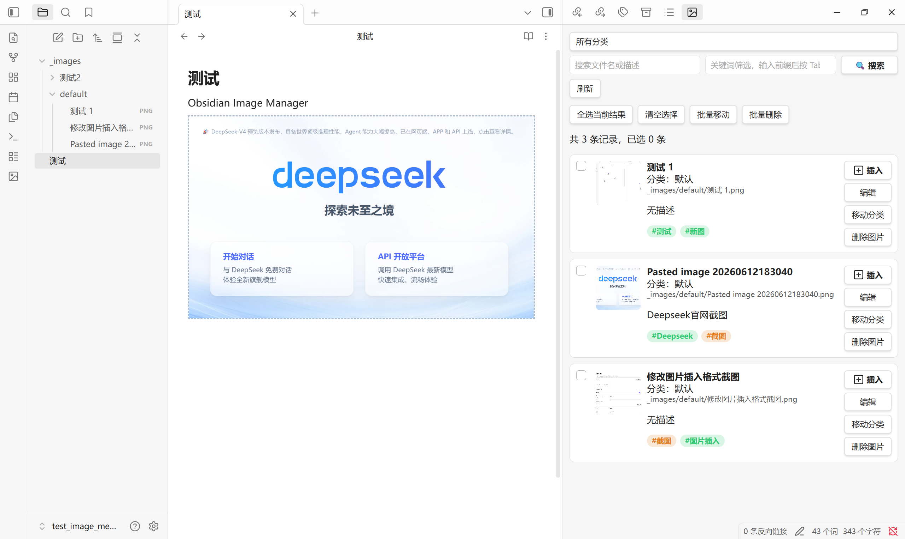
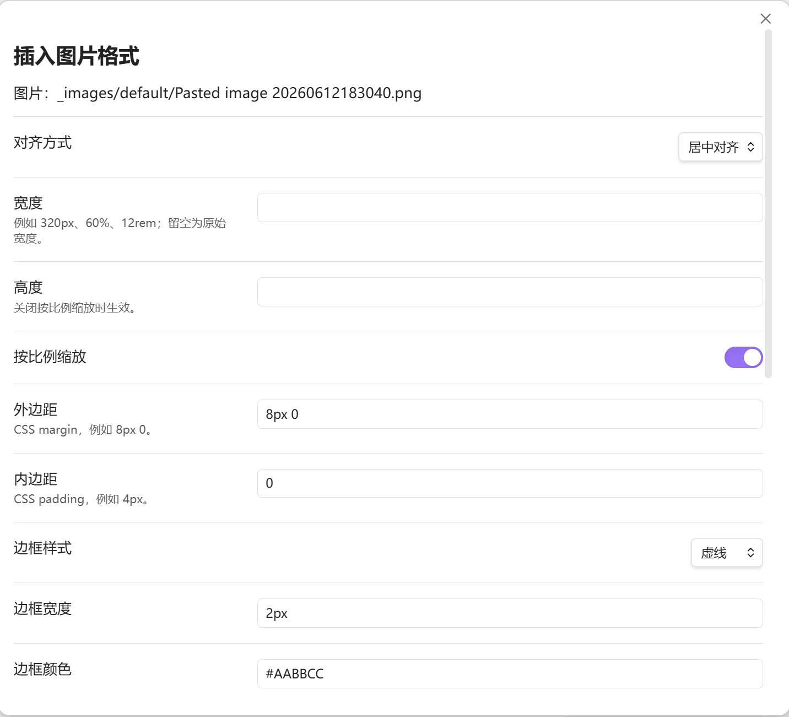

<p align="center">
  
  
  
  
</p>

<h1 align="center">Image Organizer</h1>

<p align="center"><strong>在 Obsidian 中按分类、关键词和元数据管理图片 — 支持自定义 HTML+CSS 格式插入。</strong></p>

---

> **语言**：[English](README.md) | 简体中文

## 目录

- [功能概览](#功能概览)
- [截图](#截图)
- [安装](#安装)
- [快速开始](#快速开始)
- [设置项](#设置项)
- [命令](#命令)
- [侧边栏管理视图](#侧边栏管理视图)
- [图片插入格式](#图片插入格式)
- [元数据格式](#元数据格式)
- [开发](#开发)
- [隐私说明](#隐私说明)
- [开源协议](#开源协议)

---

## 功能概览

- **多子分类管理** — 每个分类拥有独立图片文件夹和独立 JSON 元数据文件。
- **自动捕获新图片** — 监听 vault 中新建图片，引导选择分类并填写元数据。
- **自动移动图片** — 保存元数据时将图片移动到分类文件夹，支持重名策略配置。
- **JSON 数据库** — 以图片 vault 相对路径为键存储 `fileName`、`description`、`keywords`、`dateAdded`、`lastModified` 及自定义字段。
- **数据库索引** — 维护全局索引 `_images/image_metadata_index.json`，含分类列表、图片数量、关键词列表。
- **侧边栏管理视图** — 按分类浏览，搜索文件名/描述/关键词，编辑、删除记录，跨分类移动。
- **批量操作** — 多选图片进行批量移动或批量删除。
- **批量索引** — 右键文件夹可对已有图片批量建立索引，支持批量设置关键词、描述和名称。
- **HTML 图片插入** — 通过格式配置弹窗插入图片，支持对齐、尺寸、边框、间距和即时预览。
- **修改已插入图片** — 通过命令面板修改已插入文档的 HTML 图片格式。
- **命令面板集成** — 手动添加、当前笔记图片处理、移动分类、一致性扫描、复制元数据、扫描未分类图片。
- **一致性维护** — 监听图片重命名、移动、删除并同步更新元数据。
- **导出** — 复制全部分类或单个分类的元数据为 Markdown 表格或 JSON。

## 截图

### 侧边栏管理视图



### 图片插入格式弹窗



## 安装

1. 打开 Obsidian **设置 → 第三方插件**。
2. 关闭**安全模式**（如有必要）。
3. 点击**浏览**，搜索 **Image Organizer**。
4. 安装并启用插件。

### 手动安装

1. 从最新 [release](https://github.com/superwyq/Image-Organizer/releases) 下载 `main.js`、`manifest.json` 和 `styles.css`。
2. 复制到 `<vault>/.obsidian/plugins/Image-Organizer/`。
3. 重新加载 Obsidian 并启用插件。

## 快速开始

1. 启用后，打开 **设置 → Image Organizer**。
2. 查看默认分类或添加新分类，例如：
   - 分类名称：`风景`
   - 图片文件夹：`Photos/Landscape`
   - 元数据 JSON：自动设置为 `Photos/Landscape/image_metadata.json`
3. 将图片拖入 vault — 弹出分类选择和元数据填写窗口。
4. 保存后，图片移动到分类文件夹，元数据写入 JSON。

## 设置项

| 设置 | 说明 | 默认值 |
|------|------|--------|
| **监视的图片扩展名** | 逗号分隔 | `png, jpg, jpeg, gif, svg, webp, bmp` |
| **添加图片时强制选择分类** | 每次添加图片都弹出分类选择 | 关闭 |
| **移动图片时的重名策略** | 自动添加数字后缀 / 覆盖 / 询问 | 添加数字后缀 |
| **删除移动后留下的空目录** | 移动完成后尝试删除原空目录 | 开启 |
| **自定义元数据字段** | 每张图片的额外字段，逗号分隔 | — |
| **子分类** | 新增 / 编辑 / 删除带自定义图片文件夹和元数据路径的子分类 | 默认分类不可删除 |

## 命令

| 命令 | 说明 |
|------|------|
| **打开图片管理器** | 打开侧边栏管理视图 |
| **添加图片元数据** | 手动选择图片并录入元数据 |
| **为当前笔记中的图片添加元数据** | 从当前笔记或选区中提取图片链接并处理 |
| **编辑当前图片的元数据** | 当活动文件是图片时编辑其元数据 |
| **移动图片到其他分类** | 选择图片并迁移到目标分类 |
| **重新扫描所有分类的一致性** | 检查分类文件夹和 JSON，清理不存在文件的元数据 |
| **复制元数据为纯文本** | 选择范围和格式后复制到剪贴板 |
| **扫描未分类图片** | 找出尚未被任何分类 JSON 管理的图片 |
| **修改已插入图片格式** | 选中或光标定位到已插入的 HTML 图片块内，调整其格式 |

## 侧边栏管理视图

点击左侧 Ribbon 图标或运行 **打开图片管理器** 命令。

- **分类筛选** — 选择单个分类或查看所有。
- **搜索** — 按文件名或描述搜索。
- **关键词搜索** — 按关键词筛选，支持自动提示和 `Tab` 补全。
- **卡片视图** — 每张卡片显示缩略图、文件名、分类、路径、描述和彩色关键词标签。
- **卡片操作** — 编辑、插入（带格式）、移动、删除（带确认弹窗）。
- **批量操作** — 全选当前结果、清空选择、批量移动、批量删除。
- **右键菜单** — 快速访问编辑、移动和删除。

## 图片插入格式

点击卡片上的 **插入** 按钮打开格式配置弹窗：

- **对齐方式** — 左对齐 / 居中对齐 / 右对齐
- **宽度/高度** — CSS 单位（px、%、rem 等）
- **按比例缩放** — 开启/关闭
- **外边距/内边距** — CSS margin 和 padding
- **边框** — 样式（实线/虚线/点线）、宽度、颜色
- **替代文本** — 自定义 alt 文本
- **即时预览** — 实时查看效果
- **HTML 输出** — 显示生成的 `div > img` 内联 CSS 代码

生成的 HTML 将插入到最近的 Markdown 光标位置：

```html
<div style="text-align: center;"></div>
```

要修改已插入的图片格式，将光标放在 HTML 块内或选中该块，然后在命令面板中运行 **修改已插入图片格式**。

## 元数据格式

每个分类使用一个 JSON 文件：

```json
{
  "Photos/Landscape/sunset.jpg": {
    "fileName": "海边日落",
    "description": "这是一张在海边拍摄的日落照片。",
    "keywords": ["日落", "海边", "摄影"],
    "dateAdded": "2026-06-12T10:30:00.000Z",
    "lastModified": "2026-06-12T10:30:00.000Z",
    "customFields": {
      "来源": "相机导入"
    }
  }
}
```

写入 JSON 前，插件会将原文件备份为同路径 `.bak` 文件。

## 开发

```bash
# 安装依赖
npm install

# 开发模式（watch）
npm run dev

# 生产构建
npm run build

# 代码检查
npm run lint
```

构建产物为根目录下的 `main.js`。

### 发布产物

- `main.js`
- `manifest.json`
- `styles.css`

## 隐私说明

插件默认完全本地运行，不发送网络请求，不收集遥测数据，不上传 vault 内容。

## 开源协议

[MIT](LICENSE)
